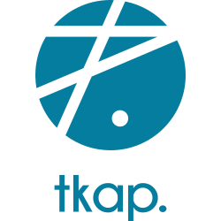

# tKAP

<p align="center">
  
</p>


tKAP is a set of Terraform / Terragrunt modules designed to get you everything
you need to run a production Kapsule cluster on Scaleway Element. It ships with
sensible defaults, and add a lot of common addons with their configurations that
work out of the box.

## Getting started

tKAP is a template project, you should clone it and then modifiy terraform
files to make them match your expectations.

### Scaleway credentials

Scaleway provider expects that you provide your Scaleway credentials.

[See the Scaleway provider
documentation](https://registry.terraform.io/providers/scaleway/scaleway/latest/docs)

If you choose to use the S3-compatible Scaleway object storage as your
Terraform backend, you also need to provide your Scaleway credentials through
the AWS SDK.

```bash
export SCW_ACCESS_KEY="foo"
export SCW_SECRET_KEY="bar"
export SCW_DEFAULT_ORGANIZATION_ID="particule"
export SCW_DEFAULT_ZONE="fr-par-1"
export AWS_ACCESS_KEY_ID=$SCW_ACCESS_KEY
export AWS_SECRET_ACCESS_KEY=$SCW_SECRET_KEY
export AWS_DEFAULT_REGION="fr-par"
```

```console
$ git clone git@github.com/particuleio/tkap
$ cd tkap/terraform/live/demo/fr-par/kapsule-s3
$ terraform init
$ terraform apply
```

